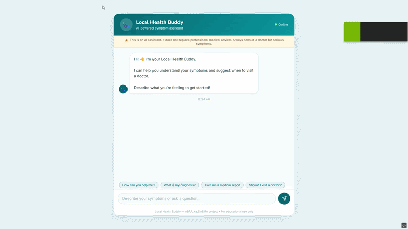
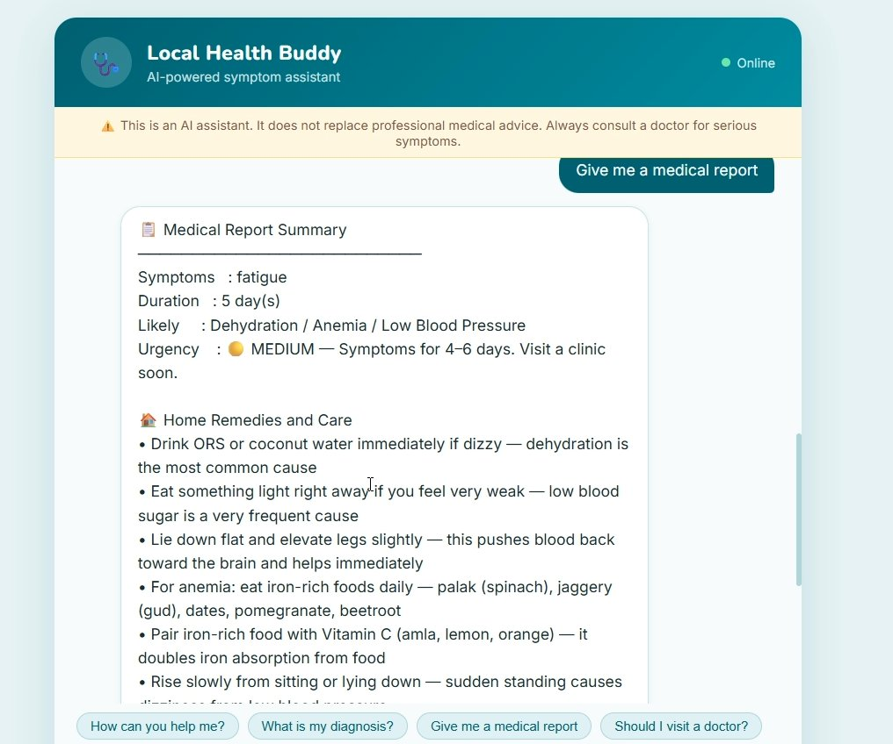

<div align="center">



# 🩺 Local Health Buddy

### AI-powered symptom assistant that understands *what* you have **and** *how long* you've had it

[
[
[
[
[
[

**[Features](#-features) -  [Demo](#-demo) -  [Tech Stack](#-tech-stack) -  [Setup](#-setup) -  [Architecture](#-architecture) -  [Challenges](#-engineering-challenges)**

</div>

***

## 📌 What is Local Health Buddy?

Most symptom checkers give you the same generic advice — *"drink water and rest"* — whether you've been sick for 1 day or 10 days.

**Local Health Buddy** fixes that. It combines **what your symptoms are** with **how long you've had them** to give you a tiered, actionable response — including a full medical report with condition-specific home remedies and the right lab tests for your situation.

> ⚠️ **Medical Disclaimer:** This is an AI-generated triage assistant for educational purposes only. It does not replace professional medical advice. Always consult a qualified doctor for serious symptoms.

***

## ✨ Features

### 🎯 Duration-Aware Diagnosis
The bot doesn't just match symptoms — it factors in duration to produce a **4-tier urgency system:**

| Urgency | Duration | Response |
|---------|----------|----------|
| 🟢 Likely Mild | 1–3 days | Home care steps |
| 🟡 Moderate Concern | 4–6 days | Visit a clinic soon |
| 🔴 High Urgency | 7+ days | See a doctor today |
| 🚨 Emergency | Any | Go to hospital immediately |

### 📋 Condition-Specific Medical Reports



Each report includes:
- **Likely condition name** (e.g. *Viral Fever / Influenza / Possible Typhoid*)
- **Urgency level** based on symptom duration
- **Home remedies & care** — 6–9 tailored steps including traditional Indian remedies (tulsi kadha, ORS recipe, haldi milk, jeera water, neem paste)
- **Suggested lab tests** — condition-specific panels (Dengue NS1 + platelet count for fever+rash; ECG + Troponin for chest pain — not a generic list)

### 🗣️ Conversational Flows Supported

| Symptom Combinations | Emergency Conditions |
|---|---|
| Fever + headache / body ache | Chest pain |
| Fever + rash (possible Dengue) | Breathlessness |
| Cough + cold / runny nose | |
| Cough + chest pain (possible Pneumonia) | |
| Nausea / vomiting + stomach pain | |
| Diarrhea + cramps | |
| Dizziness / fatigue / weakness | |
| Sore throat | |
| Rash / itching / hives | |
| Headache (standalone) | |

### 💬 Health-Themed Chat UI
- Teal/green health theme (`#01696f`)
- Chat bubbles (user right, bot left)
- Animated typing indicator
- Quick-reply chips for all main flows
- Medical report with proper multi-line formatting

***

## 🛠 Tech Stack

| Layer | Technology |
|---|---|
| Conversational AI / NLU | Dialogflow ES (Essentials) |
| Backend API | ASP.NET Core Web API (C#) |
| Frontend | ASP.NET Core MVC + Razor Views |
| Dialogflow SDK | `Google.Cloud.Dialogflow.V2` |
| JSON Handling | `Newtonsoft.Json` |
| Auth | Google Cloud Service Account (JSON key) |
| Local Tunneling | ngrok |

***

## 🏗 Architecture

```
┌─────────────┐   types message    ┌────────────────────┐
│   Browser    │ ─────────────────▶ │   ChatController    │
│  (Chat UI)   │                    │  /Chat/SendMessage   │
└─────────────┘ ◀───────────────── └──────────┬──────────┘
      ▲   bot reply (JSON)                      │
      │                            DetectIntentAsync()
      │                                         ▼
      │                             ┌─────────────────────┐
      │                             │    Dialogflow ES      │
      │                             │  (NLU + Contexts)     │
      │                             └──────────┬────────────┘
      │                                         │ webhook POST
      │                                         ▼
      │                             ┌─────────────────────┐
      └──────────────────────────── │  WebhookController   │
         fulfillment text           │  /api/webhook         │
         flows back through DF      │  (all logic lives here)│
                                     └─────────────────────┘
```

Two separate controllers, two separate purposes:

- **`ChatController`** — Serves the chat page. Relays user messages to Dialogflow via the SDK. Returns the bot's reply as JSON to the browser.
- **`WebhookController`** — Dialogflow calls *this* (via ngrok) when a webhook-enabled intent matches. All diagnosis, report, and advice logic lives here.

***

## 📁 Project Structure

```
HealthBuddyWebhook/
├── Controllers/
│   ├── WebhookController.cs   # All diagnosis / report / advice logic
│   └── ChatController.cs      # Chat UI + Dialogflow SDK integration
├── Views/
│   └── Chat/
│       └── Index.cshtml       # Health-themed chat interface
├── assets/
│   ├── demo.gif               # Live demo recording
│   └── medical-report.png     # Medical report screenshot
├── Program.cs                  # App startup, DI, middleware pipeline
├── appsettings.json             # Dialogflow ProjectId + credentials path
├── your-key-file.json          # Google service account key (gitignored)
└── HealthBuddyWebhook.csproj
```

***

## ⚙️ Setup

### Prerequisites
- [.NET 8 SDK](https://dotnet.microsoft.com/download)
- A [Google Cloud](https://console.cloud.google.com/) account with Dialogflow ES enabled
- [ngrok](https://ngrok.com/) for local webhook testing

### 1. Clone the repository
```bash
git clone https://github.com/YOUR-USERNAME/local-health-buddy.git
cd local-health-buddy
```

### 2. Install NuGet packages
```bash
dotnet add package Microsoft.AspNetCore.Mvc.NewtonsoftJson
dotnet add package Google.Cloud.Dialogflow.V2
```

### 3. Add your Google Cloud credentials
- Go to **Google Cloud Console → IAM & Admin → Service Accounts → Keys**
- Download a JSON key and place it in the project root
- In Visual Studio: right-click the file → **Properties → Copy to Output Directory → Copy if newer**

### 4. Configure `appsettings.json`
```json
{
  "Dialogflow": {
    "ProjectId": "your-dialogflow-project-id",
    "CredentialsPath": "your-key-file.json"
  }
}
```

### 5. Run the app
```bash
dotnet run
```

### 6. Expose the webhook via ngrok
```bash
ngrok http https://localhost:7083 --host-header=rewrite
```
Copy the `https://....ngrok-free.dev/api/webhook` URL into **Dialogflow Console → Fulfillment → Webhook URL**.

Enable webhook fulfillment for the `diagnosis`, `medical_report`, and `visit_doctor` intents.

### 7. Open the chat
Navigate to `https://localhost:7083/Chat`

***

## 🔄 Dialogflow Intent Flow

```
User
 └─▶ local_doctor (root — no webhook)
       └─▶ local_doctor - symptoms (no webhook, captures: symptoms)
             └─▶ local_doctor - syptoms duration (no webhook, captures: duration)
                   └─▶ local_doctor - diagnosis          ✅ webhook
                         ├─▶ local_doctor - medical_report  ✅ webhook
                         └─▶ local_doctor - visit_doctor    ✅ webhook
```

> **Note on naming:** context names use `syptoms` (missing the 'p') throughout — this was how Dialogflow auto-generated them. All references match this spelling intentionally.

***

## 🧩 Engineering Challenges Solved

| Challenge | Root Cause | Fix Applied |
|---|---|---|
| Diagnosis ignored how long symptoms lasted | Logic checked symptoms only | Rewrote to combine symptoms + duration into 4-tier urgency system |
| `symptoms`/`duration` empty in diagnosis intent | Dialogflow stores context-carried parameters inside `outputContexts`, not `queryResult.parameters` | Added `GetParameter()` helper that falls back to scanning all active output contexts |
| `symptoms`/`duration` empty again in medical_report | Output context name changes between intents; context lifespan may expire | Added in-memory session cache (`ConcurrentDictionary` by session ID) that remembers values across turns |
| `CS1061` build error on `.Symptoms` / `.Duration` | A `?:` expression mixed named and unnamed tuple literals — C# silently drops element names | Gave fallback branch matching named elements: `(Symptoms: "", Duration: "")` |
| `ERR_NGROK_3004` tunnel failure | HTTP/HTTPS mismatch | `ngrok http https://localhost:7083 --host-header=rewrite` |
| `@sys.duration` entity error in Dialogflow | That entity type doesn't exist in Dialogflow ES | Replaced with `@sys.number` |
| Same diagnosis regardless of input | Webhook toggle was off on the intent | Enabled webhook fulfillment per intent in the Dialogflow console |

***

## 🔮 Future Improvements

- [ ] Persist conversations to SQL Server / SQLite for history
- [ ] Deploy to Azure App Service with a permanent webhook (remove ngrok dependency)
- [ ] Add Hindi language support for wider accessibility
- [ ] Move session memory to Redis for multi-instance deployments
- [ ] Add user accounts for tracking symptom history over time
- [ ] Expand symptom-condition knowledge base

***

## 📄 License

This project is licensed under the MIT License — see the [LICENSE](LICENSE) file for details.

***

## 🙏 Acknowledgements

- [Google Dialogflow ES](https://cloud.google.com/dialogflow/es/docs) — NLU platform
- [Google Cloud Dialogflow V2 SDK for .NET](https://cloud.google.com/dotnet/docs/reference/Google.Cloud.Dialogflow.V2/latest)
- [ASP.NET Core Documentation](https://docs.microsoft.com/en-us/aspnet/core/)

***

<div align="center">

**Built with ❤️ as a student project**

*Local Health Buddy — ABRA_ka_DABRA project -  For educational use only*

</div>
